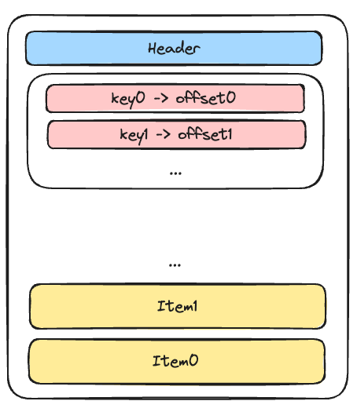

# Initial design

## Datatypes

Define a set of datatypes that the database is supposed to support. Then move on to implement a storage
engine that can store/retrieve those datatypes.
A piece of data will initially be represented as a tuple of those datatypes together with an associated key.

##### Supported data types
- `int`
- `float`
- `str`
- `bytes`

We will have to think about container types like `list` and `dict` in the future.

## API

The storage engine should implement the following initially:

```python
DBType: TypeAlias = int | float | str | bytes


def insert(key: DBType, value: tuple[DBType, ...]) -> None:
    ...

def read(key: DBType) -> tuple[DBType, ...]:
    ...
```

## Storage engine

The storage engine will store data inside pages of a fixed size. Each page starts with a header that contains
information on the type of the page, number of rows, free space and then a region of key-to-offset mappings.


### Page layout

1. Header region of fixed size
2. Key -> Offset mapping in sorted order
3. free space
4. Actual data is inserted from the back in insertion order


